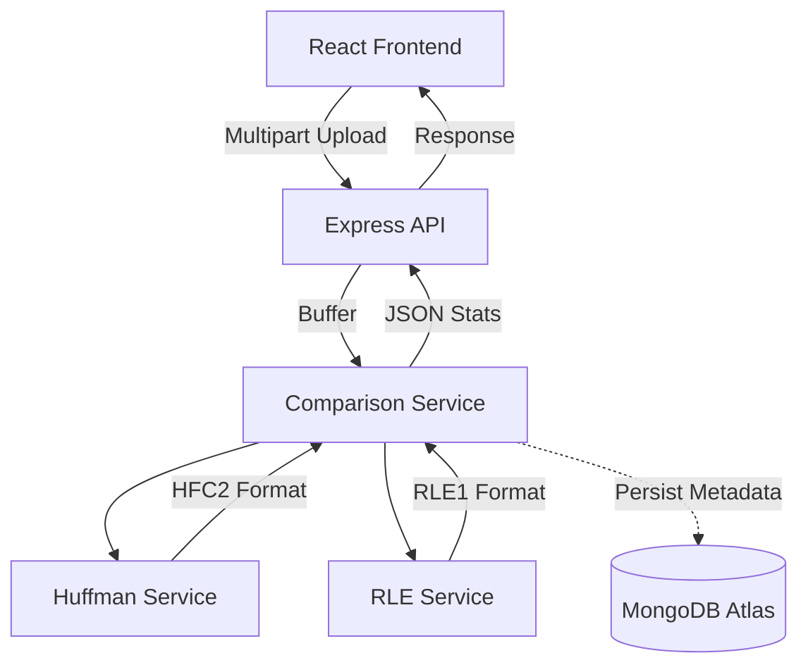

# File Compressor

**[🌍 View Live Demo](https://huffman-compressor-nine.vercel.app/)**

A full-stack, lossless file-compression web application that compares **Huffman Coding** and **Run-Length Encoding (RLE)** in real-time. Built as an educational dive into Data Structures and Algorithms (DSA), this project analyzes any uploaded file, recommends the most efficient compression algorithm, and allows users to download and restore custom `.hfc` or `.rle` archives losslessly.


## 🚀 Features
- **Real-Time Analysis**: Upload a file (up to 150MB) and see exactly how many bytes Huffman vs. RLE will save.
- **Custom Archive Formats**: Encodes and decodes custom binary `.hfc` (Huffman) and `.rle` (RLE) files.
- **Compression History**: Saves comparison metadata to MongoDB and displays a history dashboard.
- **Dark Mode UI**: Clean, responsive frontend built with React and Tailwind CSS.

## 🏗️ Architecture



## 📦 Custom Formats

### Huffman (`HFC2`)
Huffman is deterministic using a custom min-heap. The decoder rebuilds the tree directly from the 1024-byte frequency table embedded in the header.

| Size | Description |
|---|---|
| 4 bytes | Magic identifier: `HFC2` |
| 4 bytes | Original file size (UInt32BE) |
| 1 byte | Filename length |
| `n` bytes | UTF-8 Original Filename |
| 1024 bytes | 256 frequency counts × UInt32BE |
| Remaining | Packed Huffman bits |

### RLE (`RLE1`)
RLE encodes data in `[count, byte]` pairs. Runs longer than 255 bytes are split automatically (e.g., a 300-byte run of `A` becomes `[255, 65, 45, 65]`).

| Size | Description |
|---|---|
| 4 bytes | Magic identifier: `RLE1` |
| 4 bytes | Original file size (UInt32BE) |
| 1 byte | Filename length |
| `n` bytes | UTF-8 Original Filename |
| Remaining | RLE count/byte pairs |

## 🧮 Time & Space Complexity

- **Huffman Tree Construction:** `O(k log k)` where `k` is the number of unique symbols (max 256).
- **Encoding/Decoding:** `O(n)` where `n` is the number of bytes in the file.
- **Space Complexity:** `O(n)` to store the file buffers in memory. 

## ⚠️ Limitations & Edge Cases
- **Memory Storage:** Uploads are handled in RAM via Multer's `memoryStorage()`. The maximum file size is restricted to 150 MB to prevent server crashes. For true scalable large-file support, stream-based compression would be required.
- **Already Compressed Files:** Uploading `.jpg`, `.png`, `.mp3`, or `.zip` files will likely result in a larger archive size, as they are already heavily compressed. This tool performs best on raw text, CSVs, JSON, and logs.
- **Empty Files & Single-Symbol Files:** Both algorithms gracefully handle edge cases like completely empty inputs or files containing millions of identical repeating bytes.

## 💻 Running Locally

### Prerequisites
- Node.js (v18+)
- MongoDB connection string (Atlas or local)

### Backend Setup
1. Open a terminal in the root directory.
2. Install dependencies:
   ```bash
   npm install
   ```
3. Create a `.env` file in the root with your MongoDB URI:
   ```env
   MONGODB_URI=your_mongodb_connection_string
   PORT=5000
   ```
4. Start the server:
   ```bash
   npm run dev
   ```
5. Run the backend algorithm tests:
   ```bash
   npm test
   ```

### Frontend Setup
1. Open a second terminal and navigate to the client folder:
   ```bash
   cd client
   ```
2. Install dependencies:
   ```bash
   npm install
   ```
3. Start the Vite dev server:
   ```bash
   npm run dev
   ```
4. The app will be running at `http://localhost:5173`